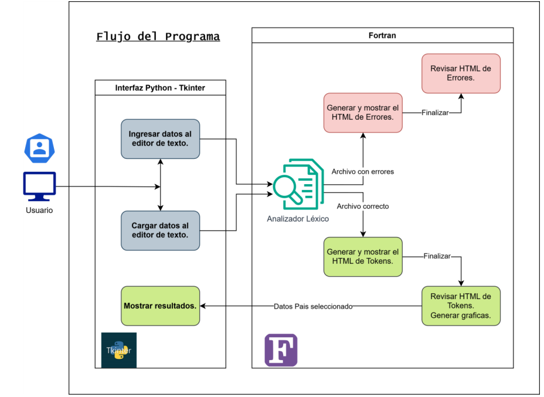

# Manual Técnico del Analizador Léxico

## Índice
1. [Introducción](#introducción)
2. [Requisitos del Sistema](#requisitos-del-sistema)
3. [Arquitectura del Sistema](#arquitectura-del-sistema)
4. [Descripción de Componentes](#descripción-de-componentes)
   - [Analizador Léxico](#analizador-léxico)
   - [Interfaz Gráfica (Tkinter)](#interfaz-gráfica-tkinter)


## Introducción

Este documento describe el funcionamiento técnico del **Analizador Léxico** desarrollado en **Fortran** con una interfaz gráfica diseñada en **Tkinter** (Python). El objetivo del programa es procesar cadenas de entrada, identificar tokens y generar su correspondiente salida léxica.

## Requisitos del Sistema

### Software
- **Fortran**: Versión 12.3 o superior.
- **Python**: Versión 3.12 5 superior.
- **Tkinter**: Incluido con Python.
- **Subprocess**: pip install subprocess.

### Hardware
- Procesador: i5 GHz o superior.
- Memoria RAM: 1 GB o más.
- Espacio en disco: 100 MB o más.

## Arquitectura del Sistema

El sistema está dividido en dos componentes principales:
1. **Motor del Analizador Léxico**: Implementado en Fortran.
2. **Interfaz Gráfica (UI)**: Implementada en Tkinter.

El flujo de datos comienza con la interfaz gráfica, donde el usuario ingresa el texto a analizar. Este texto es enviado al motor léxico escrito en Fortran, que devuelve los tokens en forma de grafo si es correcta la estructura o en una tabla hecha con html con los token si hay errores.



## Descripción de Componentes


### Analizador Léxico

El analizador léxico fue desarrollado en **Fortran** y cumple con las siguientes funcionalidades:
- **Entrada**: Recibe una archivo de texto desde la interfaz gráfica.
- **Procesamiento**: Divide la cadena en caracteres y luego en tokens siguiendo reglas léxicas predefinidas.
- **Salida**: Devuelve una lista de tokens y sus tipos asociados.


#### Estructura del Código
Este archivo muestra como abre el archivo y separa cada character para su posterior analisis en diferentes estados.

```fortran
program main
    use TokenModule
    use ErrorModule
    use lexer
    use utils
    implicit none

    character(len=1000) :: line  
    character(len=100) :: buffer_
    character(len=1) :: current_char
    type(Token), allocatable :: tokens(:)
    type(Error), allocatable :: errors(:)
    integer :: linea, columna, estado
    integer :: len_line, unit_number, iostat_code
    logical :: salto_linea
    integer :: j, temp_j 
    character(len=100) :: filename

    filename = "entradaEjemplo.org"

    linea = 1
    columna = 1
    estado = 0
    buffer_ = ""
    salto_linea = .false.
    unit_number = 20
    open(unit=unit_number, file=trim(filename), status='unknown', action='read', iostat=iostat_code)

    do
        read(unit_number, '(A)', iostat=iostat_code) line
        if (iostat_code /= 0) exit 
        
        len_line = len_trim(line)  

        do j = 1, len_line
            current_char = line(j:j) 
            temp_j = j 

            if (current_char == new_line('A')) then
                salto_linea = .true.
            else
                salto_linea = .false.
            end if
            if (current_char >= '0' .and. current_char <= '9' .or. index(buffer_,'%')>0 )then
                estado = 8

            endif
            select case (estado)
                case (0)
                    call state0(current_char, buffer_, tokens, errors, linea, columna, estado, salto_linea)
                    
                case (1)
                    call state1(current_char, buffer_, tokens, errors, linea, columna, estado, temp_j)

                case (8)
                    call stateNumero(current_char, buffer_, tokens, errors, linea, columna, estado, temp_j)

                case (2)
                    call stateCadena(current_char, buffer_, tokens, errors, linea, columna, estado)
                    
            end select
            
        end do

        linea = linea + 1
        columna = 1
    end do

    ! Cerrar el archivo
    close(unit_number)
        if (size(errors) > 0) then
            call generarHTMLErrores(errors)
            print *, 'Analisis lexico con errores. Generando reportes...'
        else
            call generarHTMLTokens(tokens)
        end if
        call generarHTMLTokens(tokens)
        print *, 'Analisis lexico completado. Generando reportes..'
end program main
```
##### Palabras Reservadas o Caracteres especiales
Dependiendo del caracter que se este leyendo hay diferentes estados. 
Si el caracter es una letra de la a a la z, se almacenara en un variable llamada buffer que al toparse con un caracter que no sea una letra entoces
empezara el analisis de la cadena de texto, y se buscara en las palabras reservadas del lenguaje (Grafica, Pais, Nombre, Poblacion, Saturacion, Continente y Bandera). Se almacenera en una estructura llamada token con las caracteristicas de "Nombre, Descripcion, Linea y Columna" en la lista de tokens. (Archivo Analizador.f90).
Si se topa con un caracter especial almacenara y revisara el buffer para saber de que tipo es, sino hay un tipo que concuerde sera almacenado como un error. 
Con los caracteres especiales revisara si es uno y lo almacenara con su nombre como tipo "{, }, ;, :"

```fortran
subroutine state1(current_char, buffer_, tokens, errors, linea, columna, estado, i)
    implicit none
    character(len=1), intent(in) :: current_char
    character(len=100), intent(inout) :: buffer_
    type(Token), allocatable, intent(inout) :: tokens(:)
    type(Error), allocatable, intent(inout) :: errors(:)
    integer, intent(inout) :: linea, columna, estado
    integer, intent(inout) :: i 
    print *, 'Estado 1 :', current_char, ' Buffer: ', buffer_, ' Linea: ', linea, ' Columna: ', columna

    if ((current_char >= 'a' .and. current_char <= 'z') .or. &
        (current_char >= 'A' .and. current_char <= 'Z')) then
        call addtoBuffer(current_char, buffer_, columna)
    else
        call processBuffer(buffer_, errors, tokens, linea, columna)
        if (.not. isSpecialChar(current_char)) then
            call goBack(i, columna, buffer_)
        end if
        call clearBuffer(buffer_)
        
        call iraState(estado, 0, buffer_)
    end if
end subroutine state1
```
##### Numero
Si el caracter es un numero, se almacenara en una variable llamada buffer que al toparse
con un caracter que no sea un numero, se almacenara en una variable llamada tokens y se
guardara en un arreglo llamado tokens. Si se detecta un "%" se guardara como un token de tipo PORCENTAJE.

```fortran
subroutine stateNumero(current_char, buffer_, tokens, errors, linea, columna, estado, i)
    implicit none
    character(len=1), intent(in) :: current_char
    character(len=100), intent(inout) :: buffer_
    type(Token), allocatable, intent(inout) :: tokens(:)
    type(Error), allocatable, intent(inout) :: errors(:)
    integer, intent(inout) :: linea, columna, estado
    integer, intent(inout) :: i
    print *, 'Estado Numero: ', current_char, ' Buffer:', buffer_, ' Linea:', linea, ' Columna:', columna
    
    if (current_char == '%') then
        call addToken(tokens, buffer_, "PORCENTAJE", linea, columna)
        call clearBuffer(buffer_)
    else if (current_char >= '0' .and. current_char <= '9') then
        call addtoBuffer(current_char, buffer_, columna)
    else
        call addToken(tokens, buffer_, "NUMERO_ENTERO", linea, columna)
        if (current_char== ';') then
            buffer_=''
            estado = 0
            call state0(current_char, buffer_, tokens, errors, linea, columna, estado, .false.)
        endif
    end if
end subroutine stateNumero
```

##### Cadena:
Si el caracter es un espacio en blanco, se ignorara. Si el caracter es un comilla
se almacenara en una variable llamada buffer almacenara todo los datos en el buffer hasta toparse con una comilla, cuando se topa con una comilla se guardara la cadenas y se almacenera como un token con la descripcion ¨cadena".

```
subroutine stateCadena(current_char, buffer_, tokens, errors, linea, columna, estado)
    implicit none
    character(len=1), intent(in) :: current_char
    character(len=100), intent(inout) :: buffer_
    type(Token), allocatable, intent(inout) :: tokens(:)
    type(Error), allocatable, intent(inout) :: errors(:)
    integer, intent(inout) :: linea, columna, estado
    logical :: cadenaAbierta
    print *, 'Estado cadena: ', current_char, ' Buffer: ', buffer_, 'Linea:', linea, 'Columna:', columna
    if (current_char == '"') then
        if (len_trim(buffer_) == 0) then
            cadenaAbierta = .true.
            
        else

            call addtoBuffer(current_char, buffer_, columna)  
            call addToken(tokens, buffer_, "CADENA", linea, columna)  
            call clearBuffer(buffer_)  
            call iraState(estado, 0, buffer_) 
        end if
    else
        
        call addtoBuffer(current_char, buffer_, columna)
    end if
end subroutine stateCadena
```

Cuando termina el archivo genera un archivo HTML con los resultados en una tabña, si tiene errores o si todos los token son correctos.
El archivo de errores para la salida la interfaz tiene prioridad. 

##### Interfaz
La funcion principal es la de generar la estructura de datos donde se almacenaran los token y posteriormente se analizaran para crear la lista de continentes con cada uno de sus paises, con la informacion sacada de aqui, se crean los grafos y las interfaces graficas.
```python
def extraer_datos_tabla(html_content):
    filas = re.findall(r'<tr>(.*?)</tr>', html_content, re.DOTALL)
    datos = []
    for fila in filas:
        celdas = re.findall(r'<td>(.*?)</td>', fila, re.DOTALL)
        celdas_limpias = [re.sub(r'<.*?>', '', celda).strip() for celda in celdas]
        if celdas_limpias:
            datos.append(celdas_limpias)
    return datos
```
```python
def construir_estructura_datos(datos):
    global listaPaises
    listaPaises = []  # Reiniciar la lista para evitar duplicados
    continentes = []
    continente_actual = None
    pais_actual = None
    estado = None
    estadoNombre = None
    tituloGrafica = "No titulo"

    for fila in datos:
        lexema = fila[0]
        tipo = fila[1]

        if tipo == "PALABRA_RESERVADA":
            if lexema.lower() == "grafica":
                estado = "GRAFICA"
            elif lexema.lower() == "continente":
                continente_actual = Continente(nombre="")
                continentes.append(continente_actual)
                estado = 'NOMBRE_CONTINENTE'
            elif lexema.lower() == "pais":
                pais_actual = Pais(nombre="", poblacion=0, saturacion="", bandera="")
                if continente_actual:
                    continente_actual.agregar_pais(pais_actual)
                listaPaises.append(pais_actual)  # Agregar el país a la lista global
                estado = 'PAIS'
                estadoNombre = "PAIS"
            elif lexema.lower() == "nombre" and estadoNombre == "PAIS":
                estado = 'NOMBRE_PAIS'
            elif lexema.lower() == "saturacion":
                estado = 'SATURACION'
            elif lexema.lower() == "poblacion":
                estado = 'POBLACION'
            elif lexema.lower() == "bandera":
                estado = 'BANDERA'
            continue

        elif tipo == "CADENA":
            if estado == 'NOMBRE_CONTINENTE':
                continente_actual.nombre = lexema.strip('"')
                estado = None
            elif estado == "GRAFICA":
                tituloGrafica = lexema
                estado = None
            elif estado == 'NOMBRE_PAIS' or estadoNombre == 'NOMBRE_PAIS':
                pais_actual.nombre = lexema.strip('"')
                estado = None
                estadoNombre = None
            elif estado == 'BANDERA' and pais_actual:
                pais_actual.bandera = 'images/' + pais_actual.nombre + '.png'
                estado = None
        
        elif tipo == "NUMERO_ENTERO":
            if estado == 'POBLACION' and pais_actual:
                pais_actual.poblacion = int(lexema.strip('"'))
                estado = None

        elif tipo == "PORCENTAJE":
            if estado == 'SATURACION' and pais_actual:
                pais_actual.saturacion = int(lexema.strip('"'))
                estado = None

    return continentes, tituloGrafica
```

Luego tenemos los archivos de ui.py que es la que crea la interfaz, continente y pais que son los objetos que usamos.
